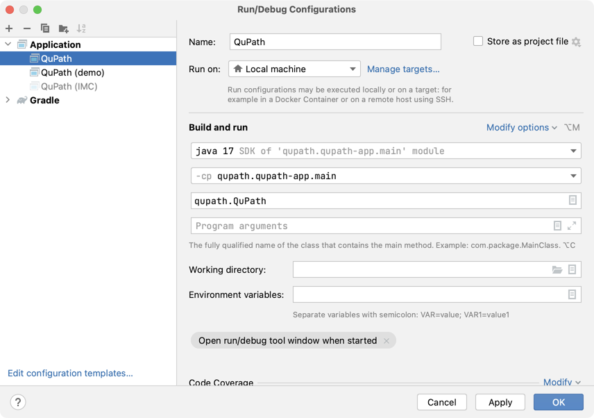

# QuPath extension template

This repo contains a template and instructions to help create a new extension for [QuPath](https://qupath.github.io).

It already contains two minimal extensions, so the first task is to make sure that they work.
Then, it's a matter of customizing the code to make it more useful.

> There are two extensions to show that you can use either Java or Groovy.

## Build the extension

Building the extension with Gradle should be pretty easy - you don't even need to install Gradle separately, because the 
[Gradle Wrapper](https://docs.gradle.org/current/userguide/gradle_wrapper.html) will take care of that.

Open a command prompt, navigate to where the code lives, and use
```bash
gradlew build
```

The built extension should be found inside `build/libs`.
You can drag this onto QuPath to install it.
You'll be prompted to create a user directory if you don't already have one.

The minimal extension here doesn't do much, but it should at least install a new command under the 'Extensions' menu in 
QuPath.

> In case your extension contains external dependencies beyond what QuPath already includes, you can create a 
> [single jar file](https://imperceptiblethoughts.com/shadow/introduction/#benefits-of-shadow) that bundles these along 
> with your extension by using
> ```bash
> gradlew shadowJar
> ```
> If you don't do that, you'll need to drag *all* the extra dependences onto QuPath to install them as well.


## Set up in an IDE (optional)

During development, things are likely to be much easier if you work within an IDE.

QuPath itself is developed using IntelliJ, and you can import the extension template there.

However, for development and testing, it can help to import QuPath *and* the extension and have them in your IDE side-by-side.

In IntelliJ, you can do this in a few steps:
* Get QuPath's source code, as described at https://qupath.readthedocs.io/en/0.4/docs/reference/building.html
* Store your extension code in a directory *beside* QuPath's code. So it should be located next to the `qupath` code directory.
* Import QuPath into IntelliJ as a Gradle project (you don't need to import the extension yet!)
   * See https://www.jetbrains.com/help/idea/work-with-gradle-projects.html
* Within `qupath/settings.gradle` add the line `includeFlat 'your-extension-code-directory'` (updating the code directory as needed)
* Refresh the Gradle project in IntelliJ, and your extension code should appear
* Create a [Run configuration](https://www.jetbrains.com/help/idea/run-debug-configuration.html) in IntelliJ to launch QuPath. An example of how that looks is shown below:



Now when you run QuPath from IntelliJ, your extension should (hopefully) be found - there's no need to add it by drag & drop.

## Customize the extension

There are a few fixed steps to customizing the extension, and then the main creative part where you add your own code.

### Update `settings.gradle`

Open `settings.gradle` and check the comment lines flagged with `\\TODO`.
These point you towards parts you may well need to change.

### Update `build.gradle`

Open `build.gradle` and follow a similar process to with `settings.gradle`, to update the bits flagged with `\\TODO`.

### Create the extension Java or Groovy file(s)

For the extension to work, you need to create at least one file that extends `qupath.lib.gui.extensions.QuPathExtension`.

There are two examples in the template, in two languages:
* **Java:** `qupath.ext.template.DemoExtension.java`.
* **Groovy:** `qupath.ext.template.DemoGroovyExtension.java`.

You can pick the one that corresponds to the language you want to use, and delete the other.

Then take your chosen file and rename it, edit it, move it to another package... basically, make it your own.

> Please **don't neglect this step!** 
> If you do, there's a chance of multiple extensions being created with the same class names... and causing confusion later.

### Update the `META-INF/services` file

For QuPath to *find* the extension later, the full class name needs to be available in `resources/META-INFO/services/qupath.lib.gui.extensions.QuPathExtensions`.

So remember to edit that file to include the class name that you actually used for your extension.

### Specify your license

Add a license file to your GitHub repo so that others know what they can and can't do with your extension.

This should be compatible with QuPath's license -- see https://github.com/qupath/qupath

### Replace this readme

Don't forget to replace the contents of this readme with your own!


## Getting help

For questions about QuPath and/or creating new extensions, please use the forum at https://forum.image.sc/tag/qupath

------

## License

This is just a template, you're free to use it however you like.
You can treat the contents of *this repository only* as being under [the Unlicense](https://unlicense.org) (except for the Gradle wrapper, which has its own license included).

If you use it to create a new QuPath extension, I'd strongly encourage you to select a suitable open-source license for the extension.

Note that *QuPath itself* is available under the GPL, so you do have to abide by those terms: see https://github.com/qupath/qupath for more.
